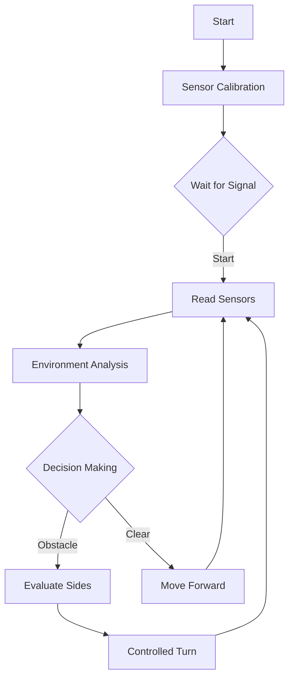

# Engineering Document / Red Machine

This repository contains all the materials needed to create "pompo", the autonomous robot built by the team "Red Machine", with the goal of participating in the Futuros Ingenieros category in the different stages of WRO Venezuela, in its 2025 edition.


# INDEX - REDMACHINE 2025

## 📌 MAIN CONTENT
1. [Engineering Document / Red Machine](#Engineering-Document--red-machine)
2. [Red-Machine-Members](https://github.com/Samu4035/REDMACHINE-2025/tree/main?tab=readme-ov-file#Red-Machine-Members)
   - [Juan Diego Cano Barros](#-juan-diego-cano-barros)
   - [Samuel José Galban Franco](#-samuel-josé-galban-franco)
   - [Angel Saúl Rodriguez Guerra](#-angel-saúl-rodriguez-guerra)
3. [Development Stages (Previous robot versions)](https://github.com/Samu4035/REDMACHINE-2025/tree/main?tab=readme-ov-file#Development-stages-Previous-robot-versions)
4. [Robot Photos](#Robot-Photos-All-Angles)
5. [Mechanical desing](#Mechanical-Design)
   - [Mechanical Assembly Guide](#-Mechanical-Assembly-Guide--red-machine)
   - [General Structure](#-General-Structure)
   - [Drive and Steering Module](#-Drive-and-Steering-Module--red-machine)
6. [Electronic Components](#Electronic-Components)
   - [Description of Main System Components](#-Description-of-Main-System-Components)
7. [Robot Power Supply](#Robot-Power-Supply)
   - [Consumption calculation](#-Total-Energy-Consumption-Calculation)
8. [Image Processing](#Image-Processing)
   - [Color Detection](#Color-Detection)
9. [How to Run or Test the Project ](#How-to-Run-or-Test-the-Project)
10. [Second Challenge Code](https://github.com/Samu4035/REDMACHINE-2025/tree/main?tab=readme-ov-file#Second-Challenge-Code)
11. [First Challenge Explination](#First-Challenge-Explination)
12. [Videos](https://github.com/Samu4035/REDMACHINE-2025/tree/main?tab=readme-ov-file#Videos-of-Pompo-Operation--Version-3.0-Contemporary-Videos)
   - [Future Engineers - Challenge 1 Variant 1](https://youtu.be/I5WXGXlZpG4?si=D2IsjQdoafDccQmA)
   - [Future Engineers - Challenge 1 Variant 2](https://youtu.be/rjQujXqtAJU?feature=shared)
   - [Future Engineers - Challenge 1 Variant 3](https://youtu.be/9T3Q66ES2Qw?feature=shared)
   - [Future Engineers - Challenge 1 Variant 4](https://youtu.be/tL3BE26AJaA?feature=shared)
   - [Future Engineers-Reto 2](https://youtu.be/XvPb05R_A2o?si=kEyuvRi_PKU7EDct)
13. [Videos of Past Tests](https://github.com/Samu4035/REDMACHINE-2025/tree/main?tab=readme-ov-file#Videos-of-Past-Tests)
14. [Troubleshooting](#troubleshooting)
15. [History and Timeline](#History-and-Timeline-of-Red-Machine)
    - [2023 Season](#2023-Season)
    - [2024 Season](#2024-Season)
    - [2025 Season](#2025-Season)
    - [Robots Evolution](#julian-luka-and-pompo)

## 📂 REPOSITORY STRUCTURE
- [t-photos/](https://github.com/Samu4035/REDMACHINE-2025/tree/main/t-photos) - Team photos
- [v-photos/](https://github.com/Samu4035/REDMACHINE-2025/tree/main/v-photos) - Vehicle photos
- [schemes/](https://github.com/Samu4035/REDMACHINE-2025/tree/main/schemes) - Eschematic diagrams
- [src/](https://github.com/Samu4035/REDMACHINE-2025/tree/main/src) - Code
- [models/](https://github.com/Samu4035/REDMACHINE-2025/tree/main/models) - 3D Designs
- [otros/](https://github.com/Samu4035/REDMACHINE-2025/tree/main/otros) - Other archives

# Repository contents

This repository contains the following directories to organize our project:

* `t-photos`: Includes team photos, as well as photos of the work done during all competition years and photos of the robots built by the team.
* `v-photos`: Contains 6 photos of the vehicle (from all angles).
* `schemes`: Schematic diagrams (JPEG, PNG or PDF) of the electromechanical components, illustrating the wiring of electronic elements and motors, plus an explanation of the function of each.
* `src`: Control software code for all components programmed for the competition.
* `models`: Files for the vehicle's 3D design.
* `other`: Additional files to understand how to prepare the vehicle for the competition.
     
# Introduction
The team has put their greatest effort into building the best possible robot. Our preparation for these olympiads has been based on extensive learning in construction, design and programming, and the experience from previous competitions has been fundamental. Long hours of track analysis and study have led to the creation of our own strategy, based on the components the team chose to work with, aiming for the best possible performance in the various stages of this competition.
Throughout this document and the entire repository, all the design, programming and construction work of the robot is explained precisely.

# Red Machine Members


## 👤 Juan Diego Cano Barros

### Role in the team
Responsible for the robot programming.

### 🧠 Academic Achievements

- 🥉 **Bronze Medal – Ibero-American Mathematics Olympiad (2023)**
He represented Venezuela in the 29th edition of this international competition organized by the OMA in Argentina, after being selected as one of the top 10 of the second national level by @acmvenojm.

- 🥈 **Runner-up – Argentine Mathematics Olympiad Ñandú (2019)**
Participated in the oral exam in Buenos Aires, standing out as the runner-up in Level 1.

---

### Robotics Background

- 🇻🇪 **Two-time National Champion – Futuros Ingenieros Category (WRO Venezuela)**
Winner of the National Robotics Olympiad in two consecutive editions, representing Zulia state and qualifying for the international finals.

- 🌍 **International Finalist – WRO Panama 2023**
Represented Venezuela at the World Robotics Olympiad, placing 25th out of 40 teams in the Futuros Ingenieros category.

- 🇹🇷 **International Participation – WRO Turkey 2024**
Was part of the Venezuelan delegation that competed at the world edition held in Turkey, consolidating experience in high-level global events.

---

### 💡 Motivation and Focus
Eat, Sleep, Meet People, Enjoy Trips, and Sleep

## 👤 Samuel José Galban Franco

### Role in the team
Responsible for the robot's electronics.

### 🧠 Academic Achievements

- 🥈 **Runner-up – National Chemistry Olympiad (2024)**
Represented Liceo Los Robles in the most recent edition of this competition organized by AVOQUIM.

- 🥈 **Runner-up – VIRTUAL MISSIONS PANAMA 2023 CHALLENGE**
Second place in this international competition, representing Venezuela during the WRO 2023 international final held in Panama.

---

### 🤖 Robotics Background

- 🇻🇪 **Two-time National Champion – Futuros Ingenieros Category (WRO Venezuela)**
Winner of the National Robotics Olympiad in two consecutive editions, representing Zulia state and qualifying for the international finals.

- 🌍 **International Finalist – WRO Panama 2023**
Represented Venezuela at the World Robotics Olympiad, placing 25th out of 40 teams in the Futuros Ingenieros category.

- 🇹🇷 **International Participation – WRO Turkey 2024**
Was part of the Venezuelan delegation that competed at the world edition held in Turkey, gaining technical and cultural experience in high-level competitive environments.

---

### 💡 Motivation and Focus
Meet people, enjoy trips, and look for study opportunities


## 👤 Angel Saúl Rodriguez Guerra

### Role in the team
Responsible for the robot's mechanics.

### 🧠 Academic Achievements
- 🥇 **Qualified for the World – World Youth Mathematics Olympiad (WYMO) (2024)**
He represented Venezuela at the World Youth Mathematics Olympiad, an international competition that brings together young mathematical talents from around the world to tackle highly challenging problems.

- 🔬 **Notable Participant – Chemistry and Mathematics Olympiads in Venezuela**
Competed in various editions of the Venezuelan Olympiads, demonstrating excellence and passion for the exact sciences from an early age.

--- 

### 🤖 Robotics Background
- 🇻🇪 **Two-time National Champion – Futuros Ingenieros Category (WRO Venezuela)**
Winner in two consecutive editions of the National Robotics Olympiad, representing Zulia state and earning selection for international competitions as part of the national delegation.

- 🌍 **International Finalist – WRO Panama 2023**
Participated in the World Robotics Olympiad held in Panama, placing 25th among 40 international teams in the Futuros Ingenieros category.

- 🇹🇷 **International Participation – WRO Turkey 2024**
Member of the Venezuelan delegation that competed in the world edition held in Turkey, accumulating technical and cultural experience in high-level competitive settings.

--- 

### 💡 Motivation and Focus
Passionate about continuous learning, creative problem solving, and collaborating in multidisciplinary teams. His track record in academic and technological competitions reflects a genuine motivation to create impact through knowledge and to keep exploring new frontiers of scientific thought and innovation.

---


# Development stages (Previous robot versions) 

   
# Mechanical System ⚙
<details> 
<summary> Version 1.0 (Outdated version) </summary>
   
## Steering
The robot's steering subsystem is located at the rear to provide a larger turning radius. It was built with LEGO pieces from a robotics kit called the LEGO Spike Prime Kit, combining these parts with the wheels from a Ford Mustang remote-controlled (RC) car, to which a Rev Robotics servo motor was adapted. It was later programmed via an Arduino Mega 2560, with the servo connected to the Arduino's GND, 5V and pin 4.

## Drive
The robot's drive subsystem was taken from a Ford Mustang remote-controlled car. This system was used because it included a motor and a gearbox, providing the torque and speed needed for the robot. It operates with a set of gears that allow the robot to turn at different speeds without losing traction; this mechanism was placed at the front of the robot. The system is powered through a dual H-bridge L298n using a pack of three 3.7 V batteries.

## Chassis design
The chassis base was built from acrylic, which was cut and drilled according to the wiring and assembly needs of the used parts.

The robot has two tiers, both built from acrylic. On the robot's first deck the traction and steering systems, the ultrasonic sensor, the RGB color sensor TCS34725, two switches (one for power and the other to start), and the dual H-bridge L298n were assembled; while on the second deck are the battery pack, the 9 V battery, the ESP32-CAM camera, the Arduino Mega 2560, and the battery connector.

## Right


## Left


## Front


## Back 


## Above


## Below


</details>

<details>   
<summary> Version 2.0 (Outdated version) </summary>
During this period, the robot's design was consistently one of the team's biggest challenges throughout all phases of the competition. The acrylic bases used in the early competitions did not work because they had many imperfections, which caused the traction and steering systems to be poorly positioned and resulted in a very poor overall layout. Despite all this, that chassis gave us an idea of how to design a new one, so after the 2023 national competition new acrylic bases were used—this time laser-cut. After that, the chassis looked really good in every respect.


Replaced with new ones that attached better to the steering system, which also improved the robot's aesthetics.
After participating in the World Cup in Panama, the team decided to make significant changes when creating the new prototype.
One notable change was bringing the wheels of the drive and steering system closer together, with the goal of increasing the turning radius and allowing tighter turns. This mainly helps with the development of the obstacle challenge, given the difficulty of the task and the strategy the team intends to use.


Approximately 5 centimeters, helping the robot gain greater freedom on the playing field and making it easier to complete the challenges. To achieve this, the acrylic parts were redesigned, with the new ones featuring a completely different structure from the previous version.


The steering system, which was once again built using LEGO pieces from the Spike Prime robotics kit number 45678. Three of these pieces were joined with a pair of wheels to complete its construction.

In the same way, a 3D design was created, allowing us to efficiently visualize and analyze every aspect related to the robot.

## Right


## Left


## Front


## Back 


## Above


## Below


> [!note]
> Below are the electronic components added during this period.

## Core Hex Motor  

> [!tip]
> It was added with the purpose of improving the robot’s traction, making it much more consistent in terms of the torque required by the robot.

> [!warning]
> It was not used in the final design due to its low speed and heavy weight.


A 2-pin JST-VH connector was used for the motor’s power supply

 


- Weight: 7 ounces
- Installation: To use this motor in the way the team requires, a 5 mm hexagonal shaft is used, with one end protruding from each side of the motor. The shaft has a length of 11.8 cm and is made of stainless steel. On each end of this shaft, a traction wheel with a diameter of 90 mm was mounted. Finally, these wheels were secured to the shaft using collars equipped with a set screw that tightens against the shaft.


as specified below:
- Torque: 3.2 N·m
- Operating Voltage: 12 V
- No-load Speed: 125 RPM


## Gyroscope

A BNO055 sensor is used to measure the degrees of each turn and determine when the robot should stop rotating. The gyroscope is utilized both to avoid traffic signals and to navigate curves.


- Connection Pins:
Vin
3V
P50
GND
PS1
SDA
INT
SCL
ADR
RST
The team uses the Vin pin to power the sensor, the GND pin for grounding, and the SDA and SCL pins to establish communication between the Arduino and the BNO055.
Data Output:
The BNO055 can provide the following sensor data:
- Absolute Orientation (Euler Vector, 100Hz): Three-axis orientation data based on a 360° sphere.
- Absolute Orientation (Quaternion, 100Hz): Four-point quaternion output for more precise manipulation.
- Angular Velocity Vector (100Hz): Three axes of rotational speed in radians per second (rad/s).
- Acceleration Vector (100Hz): Three axes of acceleration (gravity + linear motion) in meters per second squared (m/s²).
- Magnetic Field Strength Vector (20Hz): Three axes detecting magnetic field intensity in microteslas (µT).
- Linear Acceleration Vector (100Hz): Three axes of linear acceleration (acceleration minus gravity) in meters per second squared (m/s²).
- Gravity Vector (100Hz): Three axes of gravitational acceleration (excluding any movement) in meters per second squared (m/s²).
  
> [!tip]
> It was added with the purpose of improving the robot’s movement along the track by providing the exact orientation of the direction it needs to go.

> [!warning]
> It was not used in the final design because it is only an accelerometer, which causes calibration issues. The MPU6050 model is much more efficient for this task.

# Camera  
Luka uses a camera to detect the color of traffic signals. This camera is the Pixy2.


The Pixy2 operates at 60 fps and is capable of detecting objects, lines, and colors. In Luka, the camera’s main purpose is to detect colors — specifically red and green.


It is connected to the Arduino using an IDC-2 ICSP Arduino cable, which plugs into the Arduino’s ICSP pins. This setup provides all the necessary connections to power and communicate with the Pixy.

> [!tip]
> The PixyCam was used to greatly simplify the adjustments related to the color changes of the pillars. The PixyMon application is highly accessible and easy for anyone to use.

> [!warning]
> The Pixy’s power consumption is quite high for the Arduino, which was one of the main reasons for adding multiple batteries to the system.


> [!note]
> The robot’s power supply has maintained the same principles throughout all three versions.

# Robot Power Supply
In Luka, there are two independent power systems.
## 12V Circuit
This circuit uses three batteries, each providing approximately 4V. The three batteries are connected in series, so their voltages add up. The H-bridge is the electrical component that receives this power and uses it to supply two ultrasonic sensors and the traction motor.
To connect the batteries, the team uses two battery packs — each designed to hold two batteries — but one of them has been modified to use only one battery.


## 9V Circuit
This circuit uses three 9V batteries connected in parallel, so the current capacity adds up while maintaining 9V. It is connected directly to the Arduino board, which powers an ultrasonic sensor, the Pixy camera, and the servo motor. Each of these components is powered through a 5V output pin on the Arduino. 


## Wiring Diagram
The wiring diagram is shown to clearly illustrate the entire circuit.


</details>


<details>   
<summary>Version 3.0 (Outdated Version)</summary>
This robot was the "pompo" that took the team to qualify for the 2025 international wro final, to celebrate at singapore. 

# Robot Photos (All Angles)

|   |    |   |
| :----: | :-------------------: | :----------: |
|   |    |   |

> ⚠️ *Note:* If the surface is very slippery, the robot’s wheels are replaced to improve traction, following the design shown below:

|   |    |  |
| :----: | :-------------------: | :----------: |
|  |    |  |

# Mechanical Design
"Pompo" is an autonomous robot designed using LEGO pieces to achieve the highest possible precision and stability during competition rounds. These pieces were taken from a LEGO Spike Prime Kit, code 45678, and a Spike Prime Expansion Set, code 45681.
The rationale for using LEGO pieces for Pompo’s body is based on the well-known efficiency of robots built this way, considering the positive results and the ease of assembly they provide.
Additionally, in the "v-photos" section, photos of Pompo’s design are displayed, allowing efficient visualization and analysis of all components, pieces, and structures. The "models" folder contains the original 3D diagram files.
Below are photos of the 3D design of the various LEGO bases used in the structure (the original design file can be found in the "models" section):

| Image | Component | Description |
| :----: | :-------------------: | :----------: |
|  | Bases de los ultrasonidos | The ultrasonic sensors of the robot are mounted and assembled within this set of LEGO pieces. |
|   | Drive and Steering System | The motor and the bases on which it is mounted are included, ensuring it is perfectly anchored as required. Likewise, at the far end of the motor, the two bases supporting the servo motor can be seen, forming the foundation for the steering system.. |
|   | Chasis | The entire chassis structure can be seen, including the board mounts, activation button, switch, Pixy camera, and more. |

## 🛠 Mechanical Assembly Guide – Red Machine
To start, the main chassis structure is built. This base must be sturdy and symmetrical, as it will support the single rear motor and the front servo motor. It is essential to secure both components firmly, ensuring the motor is perfectly aligned to drive the robot, while the servo has freedom of movement to control steering.
Once these key elements are fixed, the central structural support is mounted. This piece runs through the chassis and stabilizes the entire base. It also serves as the backbone connecting the sides and provides greater rigidity for the installation of the upper levels.
With a firm and balanced chassis, the first deck of the robot is constructed. This platform must be placed at an appropriate height to allow space for wiring below and serve as a base for installing electrical components. Then, the second deck is elevated using structural spacers that ensure a parallel and stable platform. This second level will house the Arduino, buttons, and other control devices.
Finally, the entire structure is checked to ensure that every part is aligned, level, and securely fastened. At this stage, small adjustments can be made to correct tilts, reinforce joints, and prepare the base for wiring and mounting the electronic modules.

### 🧱 General Two-Level Structure
The robot features a two-level structure, each with defined functions to optimize organization, accessibility, and component performance:
- Lower Level: Houses the elements responsible for motor control and power distribution. Its design provides mechanical stability and electrical separation from the control components.
- Upper Level: Reserved for the command electronics and main controls. This configuration allows for better ventilation and easier, safer operation of the robot.
- 
🔋 Lower Level – Power and Motion Control
On the lower level of the robot, several essential elements are strategically distributed:
- Two H-Bridges:
One controls the motors, managing direction and speed. The other is dedicated to powering the sensors, preventing voltage fluctuations from the motors from affecting sensor readings.
- Three 9V Battery Holders: Two batteries power the Arduino, providing stable and continuous energy for data processing. One battery powers the sensor H-bridge exclusively, ensuring more reliable readings by avoiding interference or fluctuations.
⚙ This separation of power systems allows for greater efficiency, prevents cross-interference, and improves the robot’s operational precision.


⚙ Upper Level – Control and Operational Convenience
This level is dedicated to elements that require direct access by the operator:
- Arduino: Positioned in an elevated, protected area to facilitate connections, programming, and minimize vibrations.
- Double Battery Holder (3.7V): Powers auxiliary electronic modules. Its upper placement allows easy replacement and access during maintenance.
- Power Switch: Strategically located to quickly and safely turn the robot on or off.
- Start Button: Allows the robot’s routines to begin at the start of the competition, avoiding unnecessary handling in sensitive areas.
🛠 Placing these elements on the upper level improves accessibility, aids in cable organization, and protects components from mechanical activity on the lower level.


🎥 Camera – Elevated and Precise Vision
At the highest point of the robot, a camera is mounted, supported by two vertical structures holding a gray piece. This configuration was designed with the following purposes:
- Field of View: Being at the highest point, the camera avoids visual interference from other robot components.
- Environmental Isolation: Its height helps reduce the influence of external lights, reflections, or shadows from the competition field.
- Structural Stability: The rigid mounting of its supports ensures there are no vibrations or shifts that could compromise visual quality during operation.

### 🏎 Drive and Steering Module – Red Machine

⚙ Motor Support Structure
The structure shown in the image is designed to secure the motors in a stable and efficient manner:

- Rigid Mounting: The motors are anchored on a firm base built with LEGO pieces, ensuring no movement or vibrations during operation.

- Optimal Orientation: Their placement allows precise and direct traction, transmitting mechanical power without losses or deviations.

- Balanced Weight Distribution: With the motors positioned near the rear axle, the center of gravity remains low, improving stability during turns and quick maneuvers.

🚗 Rear-Wheel Drive System

The robot uses a rear-wheel drive configuration, where the motors directly drive the rear wheels:

- Mechanical Advantages: This type of drive provides greater thrust and control, especially useful for straight-line movement and climbing inclines.

- Simplicity and Efficiency: The direct connection between the motors and rear wheels reduces the need for additional gears, minimizing friction and improving energy efficiency.

🔄 Front Steering with Servo

At the front of the chassis, a servo motor is installed to act as the steering mechanism:

- Orientation Control: The servo is connected to the front wheels through a system of articulated arms, allowing the steering angle to be adjusted.

- Millimeter Precision: As a servo, angle variations are digitally controlled, enabling smooth maneuvers, tight turns, and on-the-fly corrections.

- Functional Separation: Independent steering from the drive improves the robot’s dynamic behavior and allows for more advanced navigation algorithms.
  
🧭 Central Mount for Lateral Ultrasonic Sensors
This component holds two ultrasonic sensors located on either side of the robot, fully integrated into the overall structure.

🧱 Chassis-Integrated Design
- Physical Integration with the Main Body: Although its design suggests modularity, the mount is firmly attached to the robot’s central structure, positioned in the middle of the chassis to achieve functional and structural balance.
- Strategic Anchoring: Its central location ensures the piece remains stable during movement, preventing unwanted shifts or vibrations that could affect sensor accuracy.
🎯 Lateral Sensor Positioning
- Symmetrical Distribution: The ultrasonic sensors are placed at both ends of the mount, facing outward, enhancing the robot’s horizontal environmental coverage.
- Accurate Readings: This setup allows the detection of lateral obstacles, alignment with walls, or identification of narrow spaces with greater precision during navigation.
- Protection and Visibility: Elevated and centered, the sensors have a clear field of view, free from visual interference by other components.


# Calculation of Torque Required to Move the Vehicle
The torque required (T) is calculated using the formula: 𝑇=𝑚⋅𝑔⋅𝑟

Where:
m = vehicle mass (1.02 kg)
g = gravity (9.81 m/s²)
r = wheel radius (0.02 m)

T=0.870⋅9.81⋅0.03=0.17 N⋅m

Calculation of Output Torque (after reduction) for the DC Motor 25GA370:

T_output = T_motor × Reduction
T_output = 0.2 × 1 = 0.2 > 0.17 = T_required
✅ The motor’s output torque is sufficient to move the vehicle.


## Calculation of Angular Velocity (ω) and Linear Velocity (v)
The output speed after reduction is 220.2 RPM. Converting this to radians per second:

𝜔=220.2⋅2𝜋60 ≈ 23.04rad/s

The linear velocity of the vehicle is calculated by multiplying the angular velocity by the wheel radius:

𝑣=𝜔⋅𝑟 = 23.04⋅0.03 ≈ 0.69m/s


## LEGO Motor Specifications and Gear Reduction

No-load speed: 170 RPM

Nominal torque: 0.20 kg·cm (≈ 0.0196 N·m)

Gear reduction ratio: 21.3:1

Effects of Reduction:

Reduced speed at the output shaft:
170 RPM × 21.3 ≈ 7.98 RPM

Force required to move the robot (870 g ≈ 8.53 N)

Assuming a typical friction coefficient (μ ≈ 0.4) on a normal surface:

Minimum force = μ × m × g = 0.4 × 0.87 kg × 9.81 ≈ 3.41 N

Available torque at the wheels (0.4175 N·m) is much higher than the minimum required (0.102 N·m), so the robot will move without problems.

Linear speed: ≈ 0.69 m/s (with 3 cm radius wheels)

Torque at the wheels: ≈ 0.4175 N·m (sufficient to overcome motion resistance)

✅ The system meets the traction and mobility requirements.


### 📦 System Motor Description

| Image | Component | Description |
| :----: | :-------------------: | :----------: |
|  | **Rev Robotics Servomotor** | It is an electric motor with an integrated position feedback sensor, allowing precise angular movements. It uses a signal ranging from 0V to 5V, where each voltage value corresponds to an exact angle, performing turns with high accuracy. |
|  | **lego ev3 Motor** | A device that converts electrical energy into mechanical motion, allowing, in this case, the movement of a gearbox and the wheels. Its speed and torque are determined by the voltage supplied through the H-bridge, which is controlled by the Arduino. |

In the following image, the connection and power diagram of the aforementioned components can be seen:


### Diagram Explanation

- The traction motor (large EV3 motor) is connected to the motor 1 ports of the H-bridge. A modified EV3 cable is used for this, carefully cut at one end to avoid damaging the four internal wires. The positive and negative wires are taken from these four and connected to the H-bridge.
- The servo motor is powered directly by the Arduino through the 5V and GND ports, and connected to pin 9 to receive positioning signals.
- The Arduino Mega is powered by two 9V batteries connected in parallel—negative terminals connected together on one side and positive terminals on the other—so the amperage is summed while maintaining the voltage.
- The H-bridge connects to the Arduino via a GND port to complete the bridge, as well as pins 5, 6, and 7 to control the robot’s direction and operating speed.

## Electronic Components
Although the robot’s construction was done with LEGO pieces, for all electronic components the team decided to use external parts they were already familiar with. These include the following sensors and actuators:

### 📦 Description of Main System Components

| Image | Component         | Description |
|:------:|:----------------------------:|:------------|
|  | **Ultrasonic sensor (HC-SR04)** | It uses ultrasonic waves to measure the distance to obstacles. The Arduino Mega 2560 calculates the distance based on the time it takes for the wave to travel to and from the object, allowing the robot to detect walls and make turns when necessary. |
|  | **Gyroscope (MPU6050)** | It measures the robot’s orientation in degrees. It allows maintaining straight paths and executing precise turns, especially during transitions such as 90° curves. |
|  | **Camera Pixy 2.1** | It detects specific preconfigured colors that represent signals or traffic zones. It recognizes color patterns in the image and sends data to the Arduino to execute avoidance maneuvers or automatic responses. |
|  | **Arduino Mega 2560** | ATmega2560 microcontroller that acts as the central brain of the system. It processes information from sensors, controls the motors, and manages the robot’s logical decisions. It has multiple digital and analog pins, making it ideal for complex projects. |
|  | **H-Bridge (L298N)** | It allows control of the direction and speed of DC motors. It receives signals from the Arduino and regulates the output voltage, enabling changes in rotation and motor acceleration according to the control algorithm. |

In the following image, the connection diagram of these components can be seen:


### Diagram Explanation
- The three ultrasonic sensors are connected to the Arduino via digital pins as follows:
Left ultrasonic: Pin 30 (echo), Pin 31 (trig)
Center ultrasonic: Pin 20 (echo), Pin 19 (trig)
Right ultrasonic: Pin 12 (echo), Pin 11 (trig)
They are powered through the 5V port of the H-bridge, with ground connected via the H-bridge.
- The gyroscope connects to the Arduino’s SCL and SDA pins (20 and 21) and is powered the same way as the ultrasonic sensors via the H-bridge ports.
- The Pixycam connects to the Arduino using its included cable, plugged into the Arduino’s ICSP port, which also supplies its power.
- The Arduino Mega is powered by two 9V batteries connected in parallel—negative terminals connected together on one side, positives on the other—so the amperage is summed while maintaining voltage.
- The H-bridge connects to the Arduino through a GND port to complete the bridge. It is powered by a 9V battery and supplies energy to all sensors.
- The push button connects to Arduino pins 22 and 23. When pressed, it starts the robot’s code, initiating the challenge.

> ⚠️ *Note:* In the diagram, two switches are shown; however, they represent a single double switch, which, when activated, turns on both circuits. It is depicted this way for ease of explaining the diagram.
---

# Robot Power Supply

The robot’s power system is divided into three parts:
- Arduino Power: Two 9V rechargeable batteries connected in parallel (negative wires connected together on one side and positive wires on the other).
- Sensor Power: A 9V rechargeable battery connected through an H-bridge, which powers all the system’s sensors.
- Motor Power: Two 3.7V batteries connected in parallel (one negative wire connected to one positive, leaving the other two free) to a second H-bridge, which powers the traction motor (large EV3 motor).

These systems are joined through a single switch.

### 🔋 Total Energy Consumption Calculation

| Component                      | Quantity | Estimated consumption (mA) | Total (mA) |
|--------------------------------|----------|----------------------------|------------|
| LEGO EV3 large Motor           | 1        | 250 mA (típico)            | 250 mA     |
| REV Robotics Servomotor        | 1        | 180 mA (típico)            | 180 mA     |
| HC-SR04 Ultrasonic Sensor      | 3        | 15 mA c/u                  | 45 mA      |
| PixyCam (CMUcam5)              | 1        | 140 mA                     | 140 mA     |
| Gyroscope MPU6050              | 1        | 6 mA                       | 6 mA       |
| **TOTAL**                      | —        | —                          | **621 mA** |

---

### ⚡ Power Distribution and Estimated Autonomy

The system is powered in a distributed manner to improve efficiency and facilitate energy management:

- 🔌 **2 × 9V batteries**: Power the Arduino and the servo motor.
- 🔋 **1 × 9V battery**: Supplies energy to all sensors (ultrasonics, MPU6050, PixyCam).
- 🔋 **2 × 18650 batteries (3.7V, 2000 mAh each, connected in series for 7.4V)**: Power the large EV3 motor.

| Power Source                 | Powered Components                 | Estimated consumption (mA) | Approx. Capacity | Estimated Autonomy  |
|------------------------------|------------------------------------|----------------------------|------------------|---------------------|
| 2x 9V                        | Arduino + REV Servo                | ~230 mA                    | ~500 mAh         | ~2 horas            |
| 1x 9V                        | Sensors (PixyCam, HC-SR04, MPU)    | ~191 mA                    | ~500 mAh         | ~2.6 horas          |
| 2x 18650 (7.4V, 4000 mAh)    | Large EV3 Motor                    | ~250 mA                    | 4000 mAh         | ~16 horas           |

> 💡 *Note:* The autonomy values are theoretical and may vary depending on real conditions such as motor load, visual processing, or sensor usage intensity.
> 


</details>


# Final Robot Design | Version 4.0 (Updated Version)
From this point onward, the repository describes the parts and materials used to build the most updated version of the robot.

# Robot Photos (All Angles)

|   |    |   |
| :----: | :-------------------: | :----------: |
|   |    |  |


# Mechanical Design
"Pompo" is an autonomous robot designed using LEGO pieces to achieve the highest possible precision and stability during competition rounds. These pieces were taken from a LEGO Spike Prime Kit, code 45678, and a Spike Prime Expansion Set, code 45681.
The rationale for using LEGO pieces for Pompo’s body is based on the well-known efficiency of robots built this way, considering the positive results and the ease of assembly they provide.
Additionally, in the "v-photos" section, photos of Pompo’s design are displayed, allowing efficient visualization and analysis of all components, pieces, and structures. The "models" folder contains the original 3D diagram files.
Below are photos of the 3D design of the various LEGO bases used in the structure (the original design file can be found in the "models" section):

|   |   |  |
| :----: | :-------------------: | :----------: |
|  |    |  |

## 🛠 Mechanical Assembly Guide – Red Machine
To start, the main chassis structure is built. This base must be sturdy and symmetrical, as it will support the single rear motor and the front servo motor. It is essential to secure both components firmly, ensuring the motor is perfectly aligned to drive the robot, while the servo has freedom of movement to control steering.
Once these key elements are fixed, the central structural support is mounted. This piece runs through the chassis and stabilizes the entire base. It also serves as the backbone connecting the sides and provides greater rigidity for the installation of the upper levels.
With a firm and balanced chassis, the first deck of the robot is constructed. This platform must be placed at an appropriate height to allow space for wiring below and serve as a base for installing electrical components. Then, the second deck is elevated using structural spacers that ensure a parallel and stable platform. This second level will house the Arduino, buttons, and other control devices.
Finally, the entire structure is checked to ensure that every part is aligned, level, and securely fastened. At this stage, small adjustments can be made to correct tilts, reinforce joints, and prepare the base for wiring and mounting the electronic modules.

### 🧱 General Structure
The robot features a two-level structure, each with defined functions to optimize organization, accessibility, and component performance:
- Lower Level: Houses the ultrasound sensors (4) and the elements responsible for robot movement (servomotor and motor).
Its design provides mechanical stability and the best ultrasounds position posible to accomplish the challenges.
- Upper Level: Reserved for the command electronics, main controls and powering. This configuration allows for better ventilation and easier, safer operation of the robot.

  
⚙ Lower Level – Motion Control
On the lower level of the robot, several essential elements are strategically distributed:
- Ultrasound sensors: Used to meassure pompo´s distance to the walls.
- Motor: Movement source of pompo.
- Servomotor: The motor that allows pompo to turn with an excellent precision. 

🔋 Upper Level – Control and Operational Convenience
This level is dedicated to elements that require direct access by the operator:
- Arduino: Positioned in an elevated, protected area to facilitate connections, programming, and minimize vibrations.
- Battery Holders: Power source of the whole robot. Its upper placement allows easy replacement and access during maintenance.
- Voltage regulators: Allows each component to receive the necessary voltage for optimal performance.
- Power Switch: Strategically located to quickly and safely turn the robot on or off.
- Start Button: Allows the robot’s routines to begin at the start of the competition, avoiding unnecessary handling in sensitive areas.
🛠 Placing these elements on the upper level improves accessibility, aids in cable organization, and protects components from mechanical activity on the lower level.


🎥 Camera – Elevated and Precise Vision
At the highest point of the robot, a camera is mounted, supported by two vertical structures holding a gray piece. This configuration was designed with the following purposes:
- Field of View: Being at the highest point, the camera avoids visual interference from other robot components.
- Environmental Isolation: Its height helps reduce the influence of external lights, reflections, or shadows from the competition field.
- Structural Stability: The rigid mounting of its supports ensures there are no vibrations or shifts that could compromise visual quality during operation.

### 🏎 Drive and Steering Module – Red Machine

⚙ Motor Support Structure
The structure shown in the image is designed to secure the motors in a stable and efficient manner:

- Rigid Mounting: The motors are anchored on a firm base built with LEGO pieces, ensuring no movement or vibrations during operation.

- Optimal Orientation: Their placement allows precise and direct traction, transmitting mechanical power without losses or deviations.

- Balanced Weight Distribution: With the motors positioned near the rear axle, the center of gravity remains low, improving stability during turns and quick maneuvers.

🚗 Rear-Wheel Drive System

The robot uses a rear-wheel drive configuration, where the motors directly drive the rear wheels:

- Mechanical Advantages: This type of drive provides greater thrust and control, especially useful for straight-line movement and climbing inclines.

- Simplicity and Efficiency: The direct connection between the motors and rear wheels reduces the need for additional gears, minimizing friction and improving energy efficiency.

🔄 Front Steering with Servo

At the front of the chassis, a servo motor is installed to act as the steering mechanism:

- Orientation Control: The servo is connected to the front wheels through a system of articulated arms, allowing the steering angle to be adjusted.

- Millimeter Precision: As a servo, angle variations are digitally controlled, enabling smooth maneuvers, tight turns, and on-the-fly corrections.

- Functional Separation: Independent steering from the drive improves the robot’s dynamic behavior and allows for more advanced navigation algorithms.
  
🧭 Central Mount for Lateral Ultrasonic Sensors
This component holds two ultrasonic sensors located on either side of the robot, fully integrated into the overall structure.

🧱 Chassis-Integrated Design
- Physical Integration with the Main Body: Although its design suggests modularity, the mount is firmly attached to the robot’s central structure, positioned in the middle of the chassis to achieve functional and structural balance.
- Strategic Anchoring: Its central location ensures the piece remains stable during movement, preventing unwanted shifts or vibrations that could affect sensor accuracy.
🎯 Lateral Sensor Positioning
- Symmetrical Distribution: The ultrasonic sensors are placed at both ends of the mount, facing outward, enhancing the robot’s horizontal environmental coverage.
- Accurate Readings: This setup allows the detection of lateral obstacles, alignment with walls, or identification of narrow spaces with greater precision during navigation.
- Protection and Visibility: Elevated and centered, the sensors have a clear field of view, free from visual interference by other components.


# Calculation of Torque Required to Move the Vehicle
The torque required (T) is calculated using the formula: 𝑇=𝑚⋅𝑔⋅𝑟

Where:
m = vehicle mass (1.02 kg)
g = gravity (9.81 m/s²)
r = wheel radius (0.02 m)

T=0.870⋅9.81⋅0.03=0.17 N⋅m

Calculation of Output Torque (after reduction) for the hex core motor:

T_output = T_motor × Reduction
T_output = 0.2 × 1 = 0.2 > 0.17 = T_required
✅ The motor’s output torque is sufficient to move the vehicle.


## Calculation of Angular Velocity (ω) and Linear Velocity (v)
The output speed after reduction is 220.2 RPM. Converting this to radians per second:

𝜔=220.2⋅2𝜋60 ≈ 23.04rad/s

The linear velocity of the vehicle is calculated by multiplying the angular velocity by the wheel radius:

𝑣=𝜔⋅𝑟 = 23.04⋅0.03 ≈ 0.69m/s


## Hex core motor Specifications and Gear Reduction

No-load speed: 125 RPM

Nominal torque: 32.6 kg·cm (≈ 3.2 N·m)

Gear reduction ratio: 72:1

Effects of Reduction:

Reduced speed at the output shaft:
9000 RPM ÷ 72 ≈ 125 RPM (internal motor free speed ≈ 9000 RPM → output after 72:1 gearbox = 125 RPM)

Force required to move the robot (870 g ≈ 8.53 N)

Assuming a typical friction coefficient (μ ≈ 0.4) on a normal surface:

Minimum force = μ × m × g = 0.4 × 0.87 kg × 9.81 ≈ 3.41 N

Torque required at the wheel to overcome that force:
T_required = F_min × r = 3.41 N × 0.045 m ≈ 0.154 N·m

Available torque at the wheels (stall torque at output): 3.2 N·m is much higher than the minimum required (0.154 N·m), so the robot will move without problems.

Linear speed: ≈ 0.59 m/s (with 4.5 cm radius wheels)

Torque at the wheels: ≈ 3.2 N·m (≈ 32.6 kg·cm) (sufficient to overcome motion resistance)

✅ The system meets the traction and mobility requirements.


### 📦 System Motor Description

| Image | Component | Description |
| :----: | :-------------------: | :----------: |
|  | **Rev Robotics Servomotor** | It is an electric motor with an integrated position feedback sensor, allowing precise angular movements. It uses a signal ranging from 0V to 5V, where each voltage value corresponds to an exact angle, performing turns with high accuracy. |
|  | **Hex Core Motor** | A device that converts electrical energy into mechanical motion, allowing, in this case, the movement of a gearbox and the wheels. Its speed and torque are determined by the voltage supplied through the H-bridge, which is controlled by the Arduino. |

In the following image, the connection and power diagram of the aforementioned components can be seen:


### Diagram Explanation

- The traction motor (hex core motor) is connected to the motor 1 ports of the H-bridge. A modified jh-2 cable, carefully cut at one end to avoid damaging the internal wires. The positive and negative wires are connected to the H-bridge.
- The servo motor is powered directly by the Arduino through the 5V and GND ports, and connected to pin 9 to receive positioning signals.
- The Arduino Mega is powered by two 9V batteries connected in parallel—negative terminals connected together on one side and positive terminals on the other—so the amperage is summed while maintaining the voltage.
- The H-bridge connects to the Arduino via a GND port to complete the bridge, as well as pins 5, 6, and 7 to control the robot’s direction and operating speed.

## Electronic Components
Although the robot’s construction was done with LEGO pieces, for all electronic components the team decided to use external parts they were already familiar with. These include the following sensors and actuators:

### 📦 Description of Main System Components

| Image | Component         | Description |
|:------:|:----------------------------:|:------------|
|  | **Ultrasonic sensor (HC-SR04)** | It uses ultrasonic waves to measure the distance to obstacles. The Arduino Mega 2560 calculates the distance based on the time it takes for the wave to travel to and from the object, allowing the robot to detect walls and make turns when necessary. |
|  | **Gyroscope (MPU6050)** | It measures the robot’s orientation in degrees. It allows maintaining straight paths and executing precise turns, especially during transitions such as 90° curves. |
|  | **Camera Pixy 2.1** | It detects specific preconfigured colors that represent signals or traffic zones. It recognizes color patterns in the image and sends data to the Arduino to execute avoidance maneuvers or automatic responses. |
|  | **Arduino Mega 2560** | ATmega2560 microcontroller that acts as the central brain of the system. It processes information from sensors, controls the motors, and manages the robot’s logical decisions. It has multiple digital and analog pins, making it ideal for complex projects. |
|  | **H-Bridge (L298N)** | It allows control of the direction and speed of DC motors. It receives signals from the Arduino and regulates the output voltage, enabling changes in rotation and motor acceleration according to the control algorithm. |

In the following image, the connection diagram of these components can be seen:


### Diagram Explanation
- The three ultrasonic sensors are connected to the Arduino via digital pins as follows:
Left ultrasonic: Pin 30 (echo), Pin 31 (trig)
Center lower ultrasonic: Pin 19 (echo), Pin 18 (trig)
center upper ultrasonic: Pin 39 (echo), Pin 38 (trig)
Right ultrasonic: Pin 31 (echo), Pin 30 (trig)
They are powered with 5V from the voltage regulator.
- The gyroscope connects to the Arduino’s SCL and SDA pins (20 and 21) and is powered the same way as the ultrasonic sensors via the H-bridge ports.
- The Pixycam connects to the Arduino using its included cable, plugged into the Arduino’s ICSP port, which also supplies its power.
- The Arduino Mega is powered with 8.4V from a voltage regulator
- The H-bridge connects to the Arduino through a GND port to complete the bridge. It is powered by a battery pack and powers the motor.
- The push button connects to Arduino pins 22 and 23. When pressed, it starts the robot’s code, initiating the challenge.


# Robot Power Supply

The robot’s power system is divided in two circuits:
- Motor Power Circuit: This circuit uses three batteries. The three batteries are connected in series, so the voltage is summed. The H-bridge is the electrical component that receives this energy and uses it to power the the traction motor. To connect the batteries, the team uses a battery pack of three batteries. 
- Arduino and sensors Circuit : This circuit uses the other 3 batteries, connected as well in series. The three batteries separate into two voltage regulators, one for the sensors and one for the arduino. The one that powers the sensors (gyroscope and ultrasounds) is regulated on 5v, and the one for the arduino is regulated on 8,4v. The arduino powers the servomotor and the pixycam.  These systems are joined through a single switch.

### 🔋 Total Energy Consumption Calculation

| Component                      | Quantity | Estimated consumption (mA) | Total (mA) |
|--------------------------------|----------|----------------------------|------------|
| Hex Core Motor                 | 1        | 1200 mA (típico)           | 1200 mA    |
| REV Robotics Servomotor        | 1        | 180 mA (típico)            | 180 mA     |
| HC-SR04 Ultrasonic Sensor      | 3        | 15 mA c/u                  | 45 mA      |
| PixyCam (CMUcam5)              | 1        | 140 mA                     | 140 mA     |
| Gyroscope MPU6050              | 1        | 6 mA                       | 6 mA       |
| **TOTAL**                      | —        | —                          | **1571 mA**|

---

### ⚡ Power Distribution and Estimated Autonomy

The system is powered in a distributed manner to improve efficiency and facilitate energy management:

- 🔋 **3 × 18650 batteries (3.7V, 2000 mAh each, connected in series for 11.1V)**: Goes through two voltage regulators, one for the arduino and one for the sensors.
- 🔋 **3 × 18650 batteries (3.7V, 2000 mAh each, connected in series for 11.1V)**: Power the Hex Core Motor.

| Power Source                 | Powered Components                 | Estimated consumption (mA) | Approx. Capacity | Estimated Autonomy  |
|------------------------------|------------------------------------|----------------------------|------------------|---------------------|
| 3x 3.7V (regulator at 8.4V)  | Arduino + REV Servo + pixycam      | ~240 mA                    | ~500 mAh         | ~1,45 hours         |
| 3x 3.7V (regulator at 5V)    | Sensors (HC-SR04, MPU)             | ~64 mA                     | ~500 mAh         | ~15,6 hours         |
| 3x 18650 (11.1V, 6000 mAh)   | Hex core motor                     | ~1200 mA                   | 6000 mAh         | ~5 horas            |

> 💡 *Note:* The autonomy values are theoretical and may vary depending on real conditions such as motor load, visual processing, or sensor usage intensity.
> 

# Image Processing
To process images, Pompo uses a camera. This is the Pixy2.


The Pixy2 operates at 60 fps and is capable of detecting objects, lines, and colors. In Pompo, the main purpose of the camera is to detect colors (red and green).
It connects to the Arduino using an IDC 2 ICSP Arduino cable that plugs into the Arduino’s ICSP pins, providing all necessary connections for powering and communicating with the Pixy.

## Color Detection
The Pixy2 uses a color-based filtering algorithm called the Color Connected Components (CCC) algorithm to detect objects. Pixy2 calculates the color (hue) and saturation of each RGB pixel from the image sensor and uses these as the main filtering parameters. The hue of an object remains practically unchanged under variations in lighting and exposure. Pixy2’s CCC algorithm can remember up to 7 different color signatures.

Once a color is stored in a color signature, Pixy adds it to a table of currently tracked objects and assigns it a tracking index. Then, it attempts to locate the object (and all objects in the table) in the next frame by searching for the best match. Each tracked object receives an index between 0 and 255, which it retains until it leaves the Pixy2’s field of view.


## Programming
To set the colors that the camera should detect, the team uses PixyMon. PixyMon is an application that works on Windows, macOS, and Linux. It allows you to see what the Pixy2 sees, either as raw or processed video. It also lets you configure your Pixy2, set the output port, and manage color signatures. PixyMon communicates with the Pixy2 via a standard mini USB cable.


In PixyMon, the team sets up 6 color signatures: three for green and three for red. Signatures 1, 3, and 5 are for red, and signatures 2, 4, and 6 are for green.

After this, the Arduino processing needed to be done.

On the Arduino, the team uses the Pixy2 library, which allows them to obtain all the necessary information from pixel detection. Using the following code, the team records when the Pixy detects a color and which signatures correspond to that color in a variable called «hola». If «hola» is divisible by two, the color is green; if «hola» is not divisible by two, the color is red.


# How to Run or Test the Project
To run code on an Arduino Mega board, first install the Arduino IDE on your computer if you haven’t already. Connect the board using a USB Type-B cable, and in the IDE, select “Arduino Mega or Mega 2560” from the menu Tools > Board. Next, choose the corresponding port under Tools > Port to establish communication. After that, copy and paste the code from this GitHub repository—or download the files from there and open them directly in the IDE.


After opening the project code (such as REDMACHINE-2025), check for errors by clicking the Verify (✓) button in the IDE. Once validated, press the Upload (→) button to transfer the program to the Arduino Mega board. This process uploads the code to the microcontroller, which will begin executing it automatically. Since the Mega offers greater input/output capacity and memory compared to other boards, it is ideal for demanding projects like the one in this repository.


Once the program is uploaded, you can use the IDE’s Serial Monitor to observe the system’s behavior in real time, interpret messages sent from the code, and verify that all functions are executing correctly.


# Second challenge code

---

## 1. Initialization and Setup

- IMU (MPU6050) calibration
- Pin and communication configuration (Serial, I²C, servo, motors, button)
- Centering of the steering servo (rec)
- Waiting for start signal (button on pin 23 or serial command '1')

---

## 2. Main Operation Sequence (loop)

The robot continuously repeats the following cycle:

### a) Sensor Reading


- Left (di), center (d), and right (dd) ultrasonic sensors
- Angle update using IMU (gyro)

### b) Detection of Nearby Obstacles

**Function**: `detectarladocorto()`

- If `d < 10 cm`:
  - Read distances again
  - Compare `di` vs. `dd`
  - Assign side preference:
    - `a = 1` → turn left
    - `a = 2` → turn right

### c) Second Challenge Management (girosegundoreto())

When `d < 10 cm` a front wall is detected:

| Lane  | Maneuver Sequence                                                                                    |
| ------| ---------------------------------------------------------------------------------------------------- |
| Odd   | 1. Reverse<br/>2. Turn 90° away from the wall<br/>3. Reverse for 2.5 s<br/>4. Move forward           |
| Even  | 1. Reverse for 1.8 s<br/>2. Turn 90° toward the wall<br/>3. Reverse for 2.5 s<br/>4. Move forward    |

At the end of each challenge, `vuelta++`.

### d) Cone Detection (detectarpixyY())

- The Pixy2 camera captures color blocks.
- Identifies color signature:
  - Red if signature % 2 == 1
  - Green if signature % 2 == 0
- Selects the closest block (highest m_y).
- Keeps `lastblock` if the current detection fails.

### e) Cone Evasion


**Function**: `esquivarconos()`

- Based on `a` (side) and current `lane`, perform maneuvers:
- Red cone in lane 0 →
  1. `turnRightF(45)`
  2. Servo to neutral position + delay
  3. `turnLeftF(45)`
  4. Update `lane` and `ready`
  - Analogous logic for green cones and other lanes

### f) Direction control

- **Straight Navigation** (`straightOnly(target)`):
  - Adjusts servo using proportional (PID) control
  - Maintains target angle `angulof`
- **Precise Turns** (`turnLeftF()`, `turnLeft90()`):
  - Calculate `angulof = gyro + Δ°`
  - Correct in loop until error < 2°
   - Stop servo in neutral position

---

## 3. Key Control Mechanisms

### 3.1 Lane System

| Lane   | Compartment                                   |
| ------ | --------------------------------------------- |
| 0      | Search for the first cone                     |
| 1      | After dodging the red cone from the right     |
| 2      | After dodging the green cone from the right   |
| 3      | After dodging the second red cone             |
| 4      | After dodging the second green cone           |

### 3.2 Evasion Logic

- **Red Cones**
  - 1st detection: gentle dodge (45°)
  - 2nd detection: sharp maneuver (80°)
- **Green Cones**
  - Maneuver in the opposite direction to red cones
  - Update lane according to color

---

## 4. Movement Management


- **Forward**: front motor activated
- **Backward**: rear motor activated
- **Turn**: combined servo + drive command
- **Stopped**: both motors deactivated

---

## 5. Navigation Strategy


> 💡 *Note: The indicators below represent the level of confidence the robot has in performing these sections.*

This system allows the robot to:

- Navigate the Futuros Ingenieros track
- Identify and avoid traffic signals
- Maintain precise orientation using the IMU
- Adapt its behavior to any unforeseen issues
- Complete circuits safely
  
# First challenge explination

## 🌐 **Main Flowchart**  


> ⚠️ *Note:* The functions used in Challenge 2 are the same as in Challenge 1, so both the explanation and the reasoning mentioned previously are equally valid.


### 🧪 Test Log – First Challenge

| #  | ¿Challenge completed?     | Time (s)   | Error                                       |
|----|---------------------------|------------|---------------------------------------------|
| 1  | Yes                       | 118        | None                                        |
| 2  | No                        | 121        | None                                        |
| 3  | No                        | 10         | Incorrect detection of the starting side    |
| 4  | Yes                       | 119        | None                                        |
| 5  | Yes                       | 117        | None                                        |
| 6  | Yes                       | 122        | None                                        |
| 7  | Yes                       | 120        | None                                        |
| 8  | No                        | 10         | Incorrect detection of the starting side    |
| 9  | Yes                       | 118        | None                                        |
|10  | Yes                       | 123        | None                                        |
|11  | Yes                       | 120        | None                                        |
|12  | Yes                       | 119        | None                                        |
|13  | No                        | 10         | Incorrect detection of the starting side    |
|14  | Yes                       | 118        | None                                        |
|15  | Yes                       | 120        | None                                        |
|16  | No                        | 10         | Incorrect detection of the starting side    |
|17  | Yes                       | 117        | None                                        |
|18  | Yes                       | 121        | None                                        |
|19  | Yes                       | 122        | None                                        |
|20  | No                        | 10         | Incorrect detection of the starting side    |
|21  | Yes                       | 120        | None                                        |
|22  | Yes                       | 119        | None                                        |
|23  | Yes                       | 118        | None                                        |
|24  | Yes                       | 121        | None                                        |
|25  | No                        | 10         | Incorrect detection of the starting side    |
  

Average travel time, accuracy, frequent errors.
During the testing phase of the first challenge, 25 consecutive attempts were conducted to evaluate the performance and stability of the robotic system under controlled conditions. The results obtained allow for estimating key metrics regarding the autonomous vehicle’s behavior:

⏱ Average travel time: 120 seconds

🎯 Accuracy in trajectory execution: 76%

❌ Frequently detected errors:
The most common error consisted of incorrect detection of the starting side, which caused temporary deviations or resets in the navigation logic.
To a lesser extent, slight oscillations in straight-line movement were observed, caused by variations in gyroscope readings during the early stages of the course.


# Videos of Pompo Operation | Version 4.0 (Contemporary Videos)
 - [FUTUROS INGENIEROS-Reto 1](https://youtu.be/I5WXGXlZpG4?si=D2IsjQdoafDccQmA)

[](https://youtu.be/I5WXGXlZpG4?si=D2IsjQdoafDccQmA)

- [FUTUROS INGENIEROS - Reto 1 Variante2](https://youtu.be/rjQujXqtAJU?feature=shared)

[](https://youtu.be/rjQujXqtAJU?feature=shared)

- [FUTUROS INGENIEROS - Reto 1 Variante 3](https://youtu.be/9T3Q66ES2Qw?feature=shared)

[](https://youtu.be/9T3Q66ES2Qw?feature=shared)

- [FUTUROS INGENIEROS - Reto 1 Variante 4](https://youtu.be/tL3BE26AJaA?feature=shared)

[](https://youtu.be/tL3BE26AJaA?feature=shared)
 

- [FUTUROS INGENIEROS-Reto 2](https://youtu.be/XvPb05R_A2o?si=kEyuvRi_PKU7EDct)

[](https://youtu.be/XvPb05R_A2o?si=kEyuvRi_PKU7EDct)

# Videos of Past Tests

## Version 1.0 Robot Videos
### First challenge
[](https://youtu.be/W26b5g69BQQ?si=Y7qg7TaV6iR0McLb)

### Second challenge test
[](https://youtube.com/shorts/cc8yKOo6g8U?si=XeC0w1IYvneSmaU0)


## Version 2.0 Robot Videos

### Complete Challenge 1 Video, All Variants
[
](https://www.youtube.com/watch?v=HS7eLoFSOkU)

### Complete Challenge 2 Video
[
](https://www.youtube.com/watch?v=cjjnRDXaDAU&t=56s)

## Robot videos
### Color Detection Demonstration
[
](https://www.youtube.com/shorts/HLt_O2JlURQ)

### Continuity Test
[](https://www.youtube.com/shorts/jUmZjaQ_be8)

## Videos about Red Machine
### National Presentation 2023
[](https://www.youtube.com/watch?v=fVg6WCavaBU)
### Red Machine National 2023
[](https://www.youtube.com/watch?v=FSo2NadI6ec&pp=0gcJCbIJAYcqIYzv)
### Red Machine Team Presentation
[](https://www.youtube.com/watch?v=EYFYI9Z96V4&t=25s)
### Educational Robotics
[](https://www.youtube.com/watch?v=Is-765hQCRY)


# TroubleShooting


```cpp
/*
 * Programa Simplificado de Lectura de Sensores
 * Este código lee y muestra los valores de tres sensores ultrasónicos
 * y el ángulo del giroscopio MPU6050
 */

#include <NewPing.h>        // Para sensores ultrasónicos
#include "Wire.h"           // Comunicación I2C
#include <MPU6050_light.h>  // Para el IMU MPU6050

// Definición de pines para los sensores ultrasónicos
#define TRIGGER_sensor_1  30  // Sensor izquierdo - trigger
#define ECO_sensor_1      31  // Sensor izquierdo - echo
#define TRIGGER_sensor_2  18  // Sensor central - trigger
#define ECO_sensor_2      19  // Sensor central - echo
#define TRIGGER_sensor_3  12  // Sensor derecho - trigger
#define ECO_sensor_3      11  // Sensor derecho - echo

#define MAX_DISTANCE 400  // Distancia máxima en cm (4 metros)

// Creación de objetos para los sensores
NewPing sensor_1(TRIGGER_sensor_1, ECO_sensor_1, MAX_DISTANCE);  // Izquierdo
NewPing sensor_2(TRIGGER_sensor_2, ECO_sensor_2, MAX_DISTANCE);  // Central
NewPing sensor_3(TRIGGER_sensor_3, ECO_sensor_3, MAX_DISTANCE);  // Derecho

MPU6050 mpu(Wire);  // Objeto para el IMU MPU6050

void setup() {
    Serial.begin(115200); // Iniciar comunicación serial
    Wire.begin();         // Inicializar I2C
    
    // Inicialización del MPU6050
    byte status = mpu.begin();
    Serial.println(F("Calculando offsets, no mover el MPU6050"));
    mpu.calcOffsets();    // Calibrar el IMU
    delay(1000);
    Serial.println("Listo!\n");
}

void loop() {
    detectardistancias(1);  // Leer y mostrar distancias continuamente
    delay(100);             // Pequeña pausa entre lecturas
}

// Función para detectar distancias con los sensores ultrasónicos
void detectardistancias(int serial) {
    // Leer distancias en centímetros
    int d = sensor_2.ping_cm();  // Distancia central
    int di = sensor_1.ping_cm(); // Distancia izquierda
    int dd = sensor_3.ping_cm(); // Distancia derecha
    
    // Actualizar y leer el giroscopio
    mpu.update();
    float gyro = mpu.getAngleZ();  // Obtener ángulo actual en eje Z
    
    // Mostrar los valores por el monitor serial
    Serial.print("Giroscopio (Z): ");
    Serial.print(gyro);  
    Serial.print("° | Distancias - Izq: ");
    Serial.print(di);
    Serial.print(" cm | Centro: ");
    Serial.print(d);
    Serial.print(" cm | Der: ");
    Serial.print(dd);
    Serial.println(" cm");
}
```

### Data Visualization:

Displays all values through the serial port in a readable format:

- Gyroscope angle

- Distances detected by each ultrasonic sensor

### Code Usage
  1. Upload the code to your compatible Arduino board.

  2. Open the Serial Monitor (115200 baud).
     
> 💡 *Note: The information will be displayed as follows:*
```text
Gyroscope (Z): 45.32° | Distances - left: 25 cm | Center: 30 cm | right: 0 cm
The values will update every 100 ms.
```


## Possible Hardware Errors
### Ultrasonic Sensors
False positives/negatives: Incorrect readings due to interference or absorbent surfaces

Loose connections: Improper wiring on TRIG/ECHO pins

Limited range: Objects beyond the maximum range (4 m) are not detected

### MPU6050 (IMU)
Gyroscope Drift: Loss of precision in angular measurements over time

Incorrect Calibration: Offset not properly calculated in mpu.calcOffsets()

Vibrations: Abrupt movements affect readings

### Motors and Servo
Mechanical Jams: Physical obstructions in the steering system

Wear: Loss of precision in servo movements

Insufficient Power: Voltage drops affect torque/speed

### Software Errors
Control Logic
Poorly Tuned PID: kp, ki, kd values not optimized

Race Conditions: Conflicts when executing multiple functions

Deadlocks: Locks in control loops

### Communication
Serial Buffer Full: Data loss due to not clearing the buffer

I2C Latency: Delays in communication with MPU6050

Synchronization: Mismatch between sensor readings and actions


# History and Timeline of Red Machine

1. 2023 Season
- [Julio 2023](https://github.com/Samu4035/REDMACHINE-2025/blob/main/t-photos/Historia.md#Julio-2023)
- [Agosto 2023](https://github.com/Samu4035/REDMACHINE-2025/blob/main/t-photos/Historia.md#Agosto-2023)
- [Septiembre 2023](https://github.com/Samu4035/REDMACHINE-2025/blob/main/t-photos/Historia.md#Septiembre-2023)
- [Octubre 2023](https://github.com/Samu4035/REDMACHINE-2025/blob/main/t-photos/Historia.md#Octubre-2023)
2. 2024 Season
- [Febrero 2024](https://github.com/Samu4035/REDMACHINE-2025/blob/main/t-photos/Historia.md#Febrero-2024)
- [Marzo 2024](https://github.com/Samu4035/REDMACHINE-2025/blob/main/t-photos/Historia.md#Marzo-2024)
- [Abril 2024](https://github.com/Samu4035/REDMACHINE-2025/blob/main/t-photos/Historia.md#Abril-2024)
- [Mayo 2024](https://github.com/Samu4035/REDMACHINE-2025/blob/main/t-photos/Historia.md#Mayo-2024)
- [Junio 2024](https://github.com/Samu4035/REDMACHINE-2025/blob/main/t-photos/Historia.md#Junio-2024)
- [Octubre 2024](https://github.com/Samu4035/REDMACHINE-2025/blob/main/t-photos/Historia.md#Octubre-2024)
- [Noviembre 2024](https://github.com/Samu4035/REDMACHINE-2025/blob/main/t-photos/Historia.md#Noviembre-2024)
3. 2025 Season
- [Febrero 2025](https://github.com/Samu4035/REDMACHINE-2025/blob/main/t-photos/Historia.md#Febrero-2025)
- [Marzo 2025](https://github.com/Samu4035/REDMACHINE-2025/blob/main/t-photos/Historia.md#Marzo-2025)
- [Abril 2025](https://github.com/Samu4035/REDMACHINE-2025/blob/main/t-photos/Historia.md#Abril-2025)
- [Mayo 2025](https://github.com/Samu4035/REDMACHINE-2025/blob/main/t-photos/Historia.md#Mayo-2025)
4. Julian, Luka and Pompo
- [JULIAN 1.0](https://github.com/Samu4035/REDMACHINE-2025/blob/main/t-photos/Historia.md#JULIAN-1.0)
- [JULIAN 2.0](https://github.com/Samu4035/REDMACHINE-2025/blob/main/t-photos/Historia.md#JULIAN-2.0)
- [JULIAN 3.0](https://github.com/Samu4035/REDMACHINE-2025/blob/main/t-photos/Historia.md#JULIAN-3.0)
- [JULIAN 4.0](https://github.com/Samu4035/REDMACHINE-2025/blob/main/t-photos/Historia.md#JULIAN-4.0)
- [JULIAN 5.0](https://github.com/Samu4035/REDMACHINE-2025/blob/main/t-photos/Historia.md#JULIAN-5.0)
- [LUKA 1.0](https://github.com/Samu4035/REDMACHINE-2025/blob/main/t-photos/Historia.md#LUKA-1.0)

- [LUKA 2.0](https://github.com/Samu4035/REDMACHINE-2025/blob/main/t-photos/Historia.md)

- [LUKA 3.0](https://github.com/Samu4035/REDMACHINE-2025/blob/main/t-photos/Historia.md#LUKA-3.0)

- [POMPO 1.0](https://github.com/Samu4035/REDMACHINE-2025/blob/main/t-photos/Historia.md#POMPO-1.0)

- [POMPO 2.0](https://github.com/Samu4035/REDMACHINE-2025/blob/main/t-photos/Historia.md#POMPO-2.0)

- [POMPO 3.0](https://github.com/Samu4035/REDMACHINE-2025/blob/main/t-photos/Historia.md#POMPO-3.0)

    
## 2023 Season

### July 2023

After participating in a regional robotics competition, the team decided to take part in the WRO, specifically in the Future Engineers category. As a first step, the team began studying and analyzing the competition rules.


In the following days, the team began studying what could be the first version of the chassis and investigated various ways to address the initial challenges, which were how to design the steering system and which motor to use to achieve the required speed and torque.


Next, the team began searching for motors that could be used, disassembling toys, printers, and other devices, ultimately obtaining the necessary motor by dismantling a Nikko Dodge T-rex Ram remote-controlled car, which provided the mechanical parts needed to design the steering system.

 


Subsequently, the team proceeded to assemble both systems, along with the various devices the robot would need, onto acrylic bases, completing the first prototype of what would become the chassis and allowing them to move forward with the programming phase.


For programming, an Arduino Mega 2560 was used as the controller, a dual H-bridge as a power and speed regulator, and an ultrasonic sensor to measure distance. Subsequently, the team resumed searching for solutions to detect traffic light colors, deciding to use an ESP32-CAM with an OV2640 lens, with the next challenge being how to program it with Arduino.


The team investigated which power source to use for the robot, since after using 9V batteries, they realized these were not ideal as they depleted very quickly. Consequently, two battery packs were connected, each containing eight 1.2V rechargeable cells in series, ultimately providing a total of 9.6V.

Due to space requirements, a second prototype was designed, adding a second level to the robot. The electronics were placed on the upper level, while the first level housed the batteries, the traction system, and the steering system.


Without being able to solve the programming yet, it was decided to use an RGB 34725 sensor so that the robot could detect which direction it should cross.


A strategy was proposed: it was decided to cross by detecting the color of the track lines, also using two additional ultrasonic sensors, one on each side of the robot, so that once it detected a wall, it could cross to avoid a collision. However, these two ultrasonic sensors ended up being more of a problem than a help, because when they detected something, the robot lost its trajectory. Consequently, it was ultimately decided not to use these two ultrasonic sensors.


Before the competition, the team found rechargeable batteries with a higher voltage (3.7 V), so it was decided to remove one of the two battery packs and modify the remaining pack to operate with 3 batteries.


### August 2023

After participating in the first regional competition, the team began seeking solutions to the problems encountered. It was decided to change the steering system, creating a new one using parts from a Spike Prime robotics kit, number 45678, since this new steering system would allow a larger turning radius as well as more precise turns.


New strategies were proposed, for which it was decided that the ideal way to cross would be with the help of ultrasonic sensors, and that the TCS34725 sensor would only detect the first line to determine whether the robot should cross clockwise or counterclockwise.

Continuing with the second part of the challenge, the team began programming the camera, looking for a way to transfer the camera’s information to the Arduino without using Wi-Fi. After researching several sources, they found a solution: transmitting the data through serial ports.

Then, the motor used during all this time began to fail frequently, preventing the team from progressing in the second challenge. A few days before the competition, the team extracted the motor—and consequently the gearbox—from another remote-controlled car to integrate it into the robot.


To provide a larger turning radius, the steering system was modified using pieces from a Lego Spike Prime kit.


### September 2023

Practice sessions were conducted on the track to improve the robot’s performance in challenges one and two, aiming for the best results in the 2023 national championship. The report was drafted and updated based on the progress achieved so far, followed by additional track practice to further enhance the robot’s performance in challenges one and two for the 2023 national championship.

 

The time has come for the national competition, where the team successfully achieved the goal of qualifying for the 2023 WRO World Cup in Panama.


 

### October 2023

Work continued on programming the camera for Challenge 2. The wheels of the steering system were changed to improve safety and aesthetics, and the construction of the third prototype of the robot began, focusing on restoring the acrylic parts and organizing the cables through connectors to enhance the robot’s overall appearance.


The time for the World Cup arrives, where the team ranked among the top 25 in the world and within the top 2 among Latin American countries.


## 2024 season

### February 2024

The first thing the team did to start this season was study the new rulebook, to identify the differences in the challenge and consider possible strategies for the new year.


The team began designing the new robot, taking into account everything they had learned at the World Cup. During this design phase, aspects such as size, weight, which components would be used, their placement, and the distance between the traction and steering systems were considered.


The team continued planning which strategy to use. To avoid revealing the improvements and advancements planned for the new robot, they decided it would be best to compete with Julián (the 2023 robot) during the regional competitions and use the new robot (Luka) in the national competition, which would be the biggest challenge at the time.


### March 2024

During this month, the construction of the robot for the 2024 national competition began. In the first week of March, the acrylic bases were cut and the missing components for the robot were purchased.
First, the traction system and the steering system were installed on the robot. At this stage, the steering system was built using three acrylic pieces. Afterward, the Arduino and the Raspberry Pi were installed.


At the end of March, the construction of the robot was completed after installing all the sensors it would use. Additionally, programming for Challenge 1 was started, along with Python programming for Challenge 2.


### April 2024

Since the team decided to participate with Julián in the regional competitions, work began on some improvements to the robot’s performance. One of these improvements was replacing the 34725 RGB sensor with the TCS3200 color sensor.


In preparation for the upcoming regional competition, the report was updated according to the work completed so far. The most important updates included the timeline, the wiring diagram, and the specifications of the color sensor.


2024 Regional Competitions:

Colegio Santo Tomás de Aquino 05-04-2024


### May 2024
Liceo Los Robles 05-18-2024


### June 2024

In preparation for the national competition, the team continued testing both challenges, focusing primarily on the second one; at the same time, they worked on Luka's report.
During the tests, it was decided to remove the color sensor, as it was not functioning optimally, and the side ultrasonic sensors began to be used to determine which path Luka should follow.


The team managed to fully complete the report and finished uploading all the information to GitHub by the end of the month, being fully prepared for the 2024 National WRO competition.

 


### October 2024

After winning the national competition, the team managed to become part of the delegation representing Venezuela in the international finals of the Robotics Olympiad in Izmir, Turkey. This required extensive preparation and practice, so they began working on Luka.

During the first two weeks of preparation, the team started making structural changes to Luka to reduce the size of the robot. To achieve this, both the traction and steering systems were modified. The steering system was rotated 180 degrees so that the wheels were positioned more toward the front, and the traction motor was repositioned vertically to occupy less horizontal space. After this, approximately 5 cm of unused space at the rear of the robot was removed, completing this process with the robot measuring 18 cm in length.


The third week of work marked the start of programming. After encountering issues with powering the Raspberry Pi, the team decided to look for a new method to detect traffic signals. After evaluating solutions, they chose to use a Pixy Cam because it took up less space, weighed less, and could be powered directly by the Arduino. The team also realized that a gyroscope would be necessary, especially for the second challenge, so they began using the HMS5883L magnetometer.


The Pixy Cam turned out to be an excellent choice, but the magnetometer was not, so the team started looking for a new one and chose the MPU6050. After extensive practice with the accelerometer, the team was able to use it on full curves, but due to its large margin of error, they could not rely on it to make the car turn exactly 90 degrees.


Therefore, the team used the fourth week to design a new strategy. With this new strategy, the robot was calibrated with the outer walls. 

### November 2024

The first week of November was devoted entirely to preparation and practice. During this week, the robot managed to complete two consistent laps in the second challenge, but the team remained concerned about the gyroscope issue. 


Therefore, in the second week of November, the team began practicing with a new gyroscope, the BNO055. This sensor is a hybrid of a magnetometer and an accelerometer, which allows it to provide almost exact data. 


Finally, on the 28th, 29th, and 30th of this month, the team competed in the international finals in Turkey, achieving 19th place worldwide and second place in Latin America. 

"FOTO"

This competition left the team highly motivated for the upcoming national competitions, with the goal of qualifying and achieving the best results in the international final to be held in Singapore. 


## 2025 season

### February 2025

As in previous years, Red Machine's first action at the start of a new season was to review the changes in the competition rules and scoring. The team carefully studied the new rules to ensure that everything they did was in accordance with them, and to develop and create the best robot possible. 

Under these rules, in the following weeks of this first month, work began on creating the first prototype of the new robot, “Pompo.”


### March 2025

This month, the team finished the first pompo prototype and began programming, using ROBOTC as the environment to program the ev3 module, which was the brain of this first pompo prototype. 
After long practice sessions, the team completed the first challenge perfectly, so it was time to move on to the second one. At this point, the team encountered a major problem: adapting the Pixycam to this EV3 module. 

### April 2025

After spending time looking for solutions to this problem, the team decided that it would be best to go back to working with Arduino, as the programming is very similar and the current problem could be solved much more quickly. 
Based on this, they worked for a long time to modify the entire robot chassis to adapt it to Arduino and the new sensors and motors that would be used, as those from EV3 are not directly compatible with Arduino.
Once construction was complete, the team returned to programming, but when they tested Pompo on the track, its chassis began to malfunction. 

### May 2025

For this reason, the team began working again on improving the chassis, finally achieving what would be the first definitive pompo chassis.
The scheduling of the first challenge was quick, so work on the second challenge began almost immediately. 

## Julian, luka and pompo

### JULIAN 1.0


### JULIAN 2.0


### JULIAN 3.0


### JULIAN 4.0


### JULIAN 5.0


### LUKA 1.0


### LUKA 2.0


### LUKA 3.0


### POMPO 1.0


### POMPO 2.0


### POMPO 3.0


