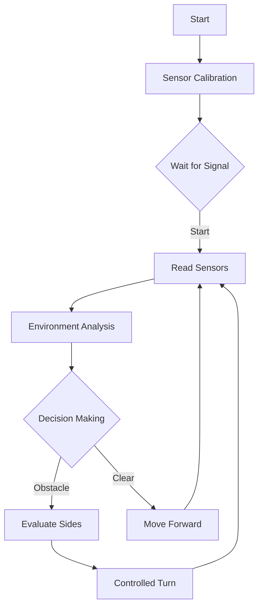

# Software design

1. Image analysis 
-  [Image Processing](https://github.com/Samu4035/REDMACHINE-2025/blob/main/src/software.md#Image-Processing)
-  [Color Detection](https://github.com/Samu4035/REDMACHINE-2025/blob/main/src/software.md#Color-Detection)
-  [Programming](https://github.com/Samu4035/REDMACHINE-2025/blob/main/src/software.md#Programming)
-  [Robot Control System](https://github.com/Samu4035/REDMACHINE-2025/blob/main/src/software.md#Robot-Control-System)

# Image Processing
To process images, Pompo uses a camera. This is the Pixy2.

The Pixy2 operates at 60 fps and is capable of detecting objects, lines, and colors. In Pompo, the main purpose of the camera is to detect colors (red and green).
It connects to the Arduino using an IDC 2 ICSP Arduino cable that plugs into the Arduino’s ICSP pins, providing all necessary connections for powering and communicating with the Pixy.

## Color Detection
The Pixy2 uses a color-based filtering algorithm called the Color Connected Components (CCC) algorithm to detect objects. Pixy2 calculates the color (hue) and saturation of each RGB pixel from the image sensor and uses these as the main filtering parameters. The hue of an object remains practically unchanged under variations in lighting and exposure. Pixy2’s CCC algorithm can remember up to 7 different color signatures.

Once a color is stored in a color signature, Pixy adds it to a table of currently tracked objects and assigns it a tracking index. Then, it attempts to locate the object (and all objects in the table) in the next frame by searching for the best match. Each tracked object receives an index between 0 and 255, which it retains until it leaves the Pixy2’s field of view.

## Programming
To set the colors that the camera should detect, the team uses PixyMon. PixyMon is an application that works on Windows, macOS, and Linux. It allows you to see what the Pixy2 sees, either as raw or processed video. It also lets you configure your Pixy2, set the output port, and manage color signatures. PixyMon communicates with the Pixy2 via a standard mini USB cable.

In PixyMon, the team sets up 6 color signatures: three for green and three for red. Signatures 1, 3, and 5 are for red, and signatures 2, 4, and 6 are for green.

After this, the Arduino processing needed to be done.

On the Arduino, the team uses the Pixy2 library, which allows them to obtain all the necessary information from pixel detection. Using the following code, the team records when the Pixy detects a color and which signatures correspond to that color in a variable called «hola». If «hola» is divisible by two, the color is green; if «hola» is not divisible by two, the color is red.

# Robot Control System

> Operational Flow and Navigation Logic for WRO Competition

---

# Second challenge code

---

## 1. Initialization and Setup

- IMU (MPU6050) calibration
- Pin and communication configuration (Serial, I²C, servo, motors, button)
- Centering of the steering servo (rec)
- Waiting for start signal (button on pin 23 or serial command '1')

---

## 2. Main Operation Sequence (loop)

The robot continuously repeats the following cycle:

### a) Sensor Reading

- Left (di), center (d), and right (dd) ultrasonic sensors
- Angle update using IMU (gyro)

### b) Detection of Nearby Obstacles

**Function**: `detectarladocorto()`

- If `d < 10 cm`:
  - Read distances again
  - Compare `di` vs. `dd`
  - Assign side preference:
    - `a = 1` → turn left
    - `a = 2` → turn right

### c) Second Challenge Management (girosegundoreto())

When `d < 10 cm` a front wall is detected:

| Lane  | Maneuver Sequence                                                                                    |
| ------| ---------------------------------------------------------------------------------------------------- |
| Odd   | 1. Reverse 2. Turn 90° away from the wall 3. Reverse for 2.5 s 4. Move forward           |
| Even  | 1. Reverse for 1.8 s 2. Turn 90° toward the wall 3. Reverse for 2.5 s 4. Move forward    |

At the end of each challenge, `vuelta++`.

### d) Cone Detection (detectarpixyY())

- The Pixy2 camera captures color blocks.
- Identifies color signature:
  - Red if signature % 2 == 1
  - Green if signature % 2 == 0
- Selects the closest block (highest m_y).
- Keeps `lastblock` if the current detection fails.

### e) Cone Evasion

**Function**: `esquivarconos()`

- Based on `a` (side) and current `lane`, perform maneuvers:
- Red cone in lane 0 →
  1. `turnRightF(45)`
  2. Servo to neutral position + delay
  3. `turnLeftF(45)`
  4. Update `lane` and `ready`
  - Analogous logic for green cones and other lanes

### f) Direction control

- **Straight Navigation** (`straightOnly(target)`):
  - Adjusts servo using proportional (PID) control
  - Maintains target angle `angulof`
- **Precise Turns** (`turnLeftF()`, `turnLeft90()`):
  - Calculate `angulof = gyro + Δ°`
  - Correct in loop until error < 2°
   - Stop servo in neutral position

---

## 3. Key Control Mechanisms

### 3.1 Lane System

| Lane   | Compartment                                   |
| ------ | --------------------------------------------- |
| 0      | Search for the first cone                     |
| 1      | After dodging the red cone from the right     |
| 2      | After dodging the green cone from the right   |
| 3      | After dodging the second red cone             |
| 4      | After dodging the second green cone           |

### 3.2 Evasion Logic

- **Red Cones**
  - 1st detection: gentle dodge (45°)
  - 2nd detection: sharp maneuver (80°)
- **Green Cones**
  - Maneuver in the opposite direction to red cones
  - Update lane according to color

---

## 4. Movement Management

- **Forward**: front motor activated
- **Backward**: rear motor activated
- **Turn**: combined servo + drive command
- **Stopped**: both motors deactivated

---

## 5. Navigation Strategy

> 💡 *Note: The indicators below represent the level of confidence the robot has in performing these sections.*

This system allows the robot to:

- Navigate the Futuros Ingenieros track
- Identify and avoid traffic signals
- Maintain precise orientation using the IMU
- Adapt its behavior to any unforeseen issues
- Complete circuits safely
  
# First challenge explination

## 🌐 **Main Flowchart**  

> ⚠️ *Note:* The functions used in Challenge 2 are the same as in Challenge 1, so both the explanation and the reasoning mentioned previously are equally valid.

### 🧪 Test Log – First Challenge

| #  | ¿Challenge completed?     | Time (s)   | Error                                       |
|----|---------------------------|------------|---------------------------------------------|
| 1  | Yes                       | 118        | None                                        |
| 2  | No                        | 121        | None                                        |
| 3  | No                        | 10         | Incorrect detection of the starting side    |
| 4  | Yes                       | 119        | None                                        |
| 5  | Yes                       | 117        | None                                        |
| 6  | Yes                       | 122        | None                                        |
| 7  | Yes                       | 120        | None                                        |
| 8  | No                        | 10         | Incorrect detection of the starting side    |
| 9  | Yes                       | 118        | None                                        |
|10  | Yes                       | 123        | None                                        |
|11  | Yes                       | 120        | None                                        |
|12  | Yes                       | 119        | None                                        |
|13  | No                        | 10         | Incorrect detection of the starting side    |
|14  | Yes                       | 118        | None                                        |
|15  | Yes                       | 120        | None                                        |
|16  | No                        | 10         | Incorrect detection of the starting side    |
|17  | Yes                       | 117        | None                                        |
|18  | Yes                       | 121        | None                                        |
|19  | Yes                       | 122        | None                                        |
|20  | No                        | 10         | Incorrect detection of the starting side    |
|21  | Yes                       | 120        | None                                        |
|22  | Yes                       | 119        | None                                        |
|23  | Yes                       | 118        | None                                        |
|24  | Yes                       | 121        | None                                        |
|25  | No                        | 10         | Incorrect detection of the starting side    |
  

Average travel time, accuracy, frequent errors.
During the testing phase of the first challenge, 25 consecutive attempts were conducted to evaluate the performance and stability of the robotic system under controlled conditions. The results obtained allow for estimating key metrics regarding the autonomous vehicle’s behavior:

⏱ Average travel time: 120 seconds

🎯 Accuracy in trajectory execution: 76%

❌ Frequently detected errors:
The most common error consisted of incorrect detection of the starting side, which caused temporary deviations or resets in the navigation logic.
To a lesser extent, slight oscillations in straight-line movement were observed, caused by variations in gyroscope readings during the early stages of the course.

